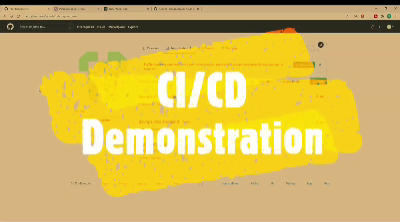

# App Background
* This repository contains the front-end component of a MERN-stack project created for the NUS SGUS Fintech program.
* This App simulates a primitive banking administrative portal and is intended as a demonstration of CRUD(Create, Read, Update, Delete) APIs across a full MERN stack.
* The project's MERN-stack utilizes the following:
  * React.js - front-end
  * Express.js & Node.js - back-end
  * mySQL - database
* The entire stack has been deployed on three separate Heroku Apps on Heroku simulating the front-end, back-end and database. 
* The back-end module is deployed in a Docker container through [Heroku's Container Registry](https://devcenter.heroku.com/articles/container-registry-and-runtime).
* The mySQL database is hosted on [Heroku's ClearDB mySQL App add-on](https://elements.heroku.com/addons/cleardb).

### You can view the Heroku-hosted App [here](https://devops-cicd-project.herokuapp.com/).

Note: Apps hosted on Heroku go to sleep after a period of inactivity. Initial loading/queries may take 10-15s as the App re-awakens.

# Continuous Integration/Continuous Deployment (CI/CD)
* This App uses GitHub Actions to execute a CI/CD pipeline.
* You can view the GitHub Actions workflow file [here](https://github.com/sjdude/devops-CICD-project/blob/main/.github/workflows/devops_cicd_project.yml).
* GitHub repository secrets are used to store security sensitive data like the Heroku API keys.
* On a git push to the main branch, the following will occur in the respective order:
  * The main line of the git repository is updated.
  * App dependencies are re-installed using Node package manager(npm) in this case.
  * The updated App is deployed on Heroku.

### You can view the Heroku-hosted App [here](https://devops-cicd-project.herokuapp.com/).
### See the demonstration of the CI/CD pipeline [here](https://youtu.be/JLPiXLNLqqA).

# To run this App locally, run the following commands from your cl:
#### 1. `git clone https://github.com/sjdude/devops-CICD-project.git`
From the project folder directory run the following:
#### 2. `npm install`
#### 3. `npm start`
